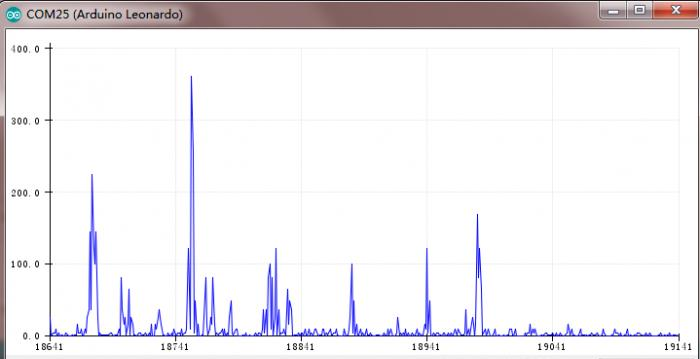

# 🤖 EMG-Controlled Robotic Hand

## Overview
A prosthetic robotic hand controlled using **muscle signals (EMG)**. The system enables people with hand disabilities to control a robotic hand through natural muscle contractions.

It uses **EMG sensors, Arduino Uno, and a servo motor** to detect muscle activity and translate it into real-time hand movement.

---

## Problem
People with motor disabilities face difficulties performing daily tasks, and many prosthetic systems are expensive or lack intuitive control.

---

## Solution
A low-cost assistive system that:
- Reads muscle signals using EMG sensors.
- Processes signals with Arduino.
- Controls a servo motor to move the hand.
- Displays muscle status on an LCD screen.

Control is achieved **directly through muscle activity**, making it natural and user-friendly.

---

## System Architecture
Muscle → ECG Electrodes → EMG Sensor → Arduino → Servo Motor → Robotic Hand + LCD Display

---

## Technologies

### Hardware
- Arduino Uno  
- EMG Sensor & ECG Electrodes  
- Servo Motor  
- 16x2 LCD  
- Lithium Battery  

### Software
- Arduino IDE  
- C++ 
- Libraries: Servo, LiquidCrystal_I2C, MsTimer2  

---

## Workflow
1. EMG sensors detect muscle contractions.  
2. Arduino reads and processes the signal.  
3. Servo motor moves the robotic hand.  
4. LCD displays muscle state (active / weak / inactive).  

---

## Key Features
- Real-time muscle detection  
- Natural human-robot interaction  
- Visual feedback  
- Portable and low-cost  

---

## Challenges
- EMG signal noise  
- Sensor calibration  
- Real-time response stability  

---

## Results
The system successfully detects muscle activity, moves the robotic hand accordingly, and displays accurate muscle status in real time.

---

## Social Impact
Supports people with disabilities by improving independence and quality of life through assistive technology.

---

## Future Improvements  
- Wireless control  
- Mobile app interface  
- Multi-finger control  

---

## Demo & Media

